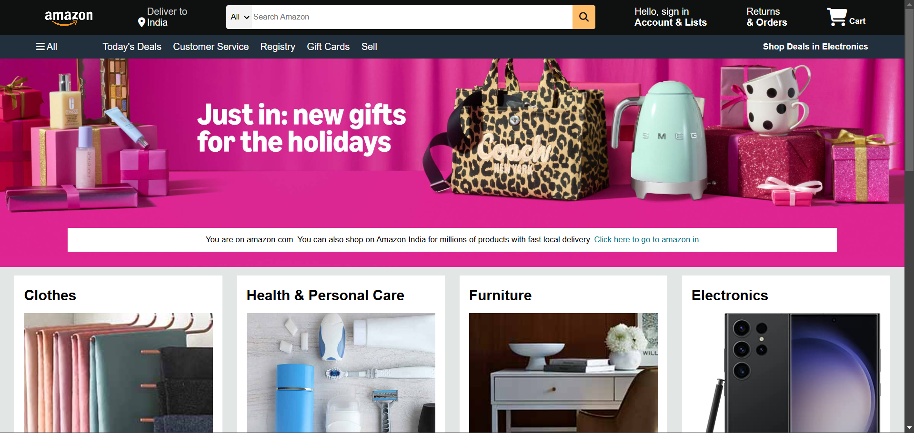

# This is my amazon clone
# Amazon Clone

This is a simple Amazon clone created using HTML and CSS. The project replicates the basic design and layout of the Amazon homepage.

## Features
- Responsive design for different screen sizes
- Header with search bar, navigation menu, and logo
- Product grid showcasing multiple items
- Footer with useful links and information

## Technologies Used
- **HTML**: For structuring the web page
- **CSS3**: For styling and layout

## How to Use
1. Clone this repository to your local machine:
   ```bash
   git clone https://github.com/yourusername/amazon-clone.git
   ```
2. Navigate to the project folder:
   ```bash
   cd amazon-clone
   ```
3. Open `index.html` in your web browser to view the project.

## Project Structure
```
amazon-clone/
├── index.html
├── styles/
│   └── style.css
├── assets/
│   └── amazon_clone.png  # Add this file

```

## Screenshots

*Screenshot of the Amazon clone homepage.*

## Contributing
Contributions are welcome! If you'd like to enhance this project, feel free to:
- Fork the repository
- Create a new branch for your feature or fix
- Submit a pull request

## License
This project is open source and available under the [MIT License](LICENSE).

---

*This project is for educational purposes only and is not affiliated with or endorsed by Amazon.*
